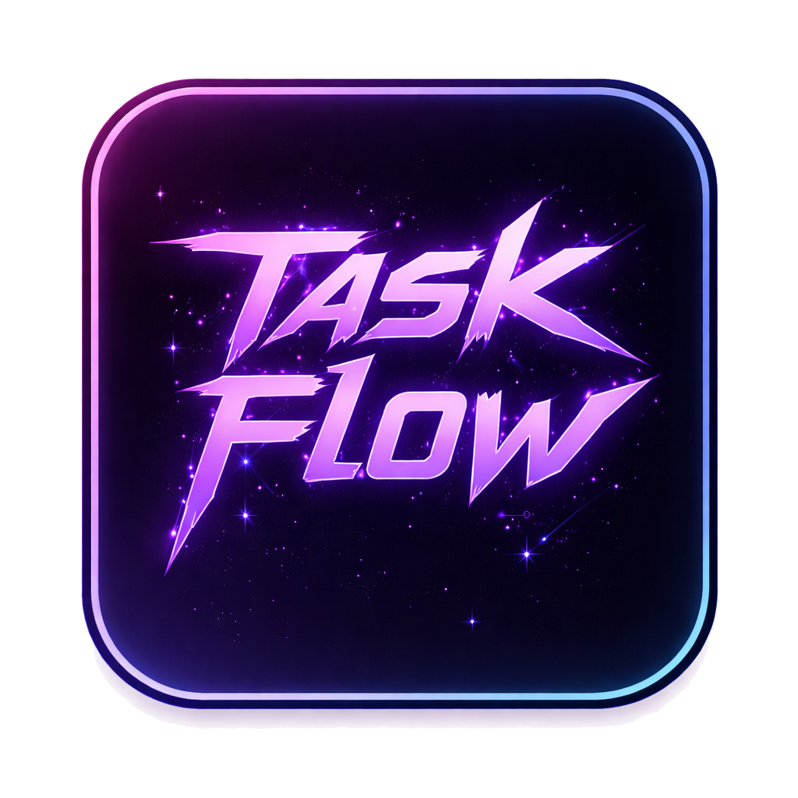

<div align="center">

# ⚡ TaskFlow



### Intelligent Task Management for macOS

*Capture • Organize • Conquer*

[](../../releases)
[](https://www.apple.com/macos/)
[](https://swift.org)
[](LICENSE)

---

**A cyberpunk-themed productivity app with AI-powered task capture, Kanban boards, annual calendar planning, and Pomodoro timer.**

</div>

---

## ✨ Features

### 📋 Kanban Board
Organize tasks with a beautiful drag-and-drop board featuring responsive columns:
- **Backlog** → **To Do** → **In Progress** → **Done** → **Deleted**
- Columns resize proportionally to fit any window size
- All columns always visible - no hidden workflow stages

### 📅 Annual Calendar *(New in v1.2.0)*
Plan your entire year at a glance:
- **12-month grid layout** with day-of-week indicators
- **10 cyberpunk color categories** for event organization
- **Drag-to-move** events to reschedule instantly
- **Drag-to-resize** events by pulling the edge
- **Task activity indicators** showing ↑added and ↓completed per day
- **Multi-event popover** to access all events on busy days
- **Keyboard navigation** with arrow keys, Enter, and Escape

### 📸 Screenshot Capture
Press `⌘⇧C` to capture any screen area. Screenshots auto-attach to new tasks for visual context.

### 🤖 AI-Powered Task Titles
Local LLM generates smart, action-oriented task titles from your screenshots. Runs 100% offline via Ollama - your data never leaves your Mac.

### ⏱️ Pomodoro Timer
Built-in time tracking with configurable work/break intervals and visual countdown.

### 📧 Outlook Integration
Drag `.eml` files directly into TaskFlow to create tasks from emails.

---

## 🎨 Cyberpunk Color Palette

| Category | Color | Hex Code |
|:---------|:------|:---------|
| Neon Pink | 🟣 | `#FF006E` |
| Electric Blue | 🔵 | `#00F5FF` |
| Acid Green | 🟢 | `#39FF14` |
| Hot Orange | 🟠 | `#FF6B35` |
| Deep Purple | 🟣 | `#9D4EDD` |
| Golden Yellow | 🟡 | `#FFE66D` |
| Crimson Red | 🔴 | `#DC143C` |
| Mint Green | 🟢 | `#00FF7F` |
| Sky Blue | 🔵 | `#87CEEB` |
| Lavender | 🟣 | `#E6E6FA` |

---

## 🔒 Privacy First

- **Local SQLite Database** — All data stays on your Mac
- **On-Device AI** — Ollama runs entirely locally
- **Zero Telemetry** — No tracking, no cloud sync, no data collection
- **Full Backup Control** — Export/import your data anytime (now includes calendar events!)

---

## 📥 Installation

### Requirements
- macOS 13 (Ventura) or later
- Apple Silicon (M1/M2/M3) or Intel Mac
- 5GB free disk space (for AI model)

### Quick Install
1. Download the latest DMG from [Releases](../../releases)
2. Open the DMG and drag `TaskFlow.app` to Applications
3. Right-click → **Open** (required for first launch)
4. Grant Screen Recording permission when prompted

### Full Install (with AI Features)
```bash
# Open the DMG and run the installer script:
./install-taskflow.sh
```
The installer sets up Ollama and downloads the AI model automatically.

> **Note:** macOS may show *"Apple could not verify TaskFlow"* on first launch. This is normal for apps outside the App Store. Right-click → Open → Click Open.

---

## ⌨️ Keyboard Shortcuts

| Shortcut | Action |
|:---------|:-------|
| `⌘⇧C` | Capture screenshot for new task |
| `⌘N` | New task |
| `⌘,` | Open settings |
| `⌘Q` | Quit TaskFlow |
| `← → ↑ ↓` | Navigate calendar days |
| `Enter` | Create/edit calendar event |
| `Escape` | Cancel or deselect |

---

## 🛠️ Building from Source

```bash
# Clone the repository
git clone https://github.com/Pezz-OneNil/TaskFlow.git
cd TaskFlow/TaskFlow

# Build release version
swift build -c release

# Build app bundle with DMG
./build-app.sh --dmg

# Install to Applications
cp -r TaskFlow.app /Applications/
```

---

## 📁 Project Structure

```
TaskFlow/
├── Sources/
│   ├── TaskFlow/           # Main app entry point
│   └── TaskFlowLib/        # Core library
│       ├── Models/         # Data models (TFM-prefixed)
│       ├── Views/          # SwiftUI views
│       ├── Services/       # Business logic (TFM-prefixed)
│       ├── Persistence/    # Database layer (TFM-prefixed)
│       └── Testing/        # Documentation tests
├── Tests/                  # Unit & property tests
├── Resources/              # App icons & assets
└── Installer/              # DMG creation scripts
```

> **Note:** All public types use the `TFM` prefix (TaskFlowMac) to avoid naming conflicts with TaskFlowTurbo. See [NAMING_CONVENTIONS.md](../NAMING_CONVENTIONS.md) for details.

---

## 📛 Naming Conventions

TaskFlowMac uses the `TFM` prefix for types that have counterparts in TaskFlowTurbo. This allows both projects to coexist in the same workspace.

| Type | Prefixed Name |
|:-----|:--------------|
| Task | TFMTask |
| TaskManager | TFMTaskManager |
| SettingsManager | TFMSettingsManager |
| CalendarEvent | TFMCalendarEvent |

For the complete naming convention guide, see [NAMING_CONVENTIONS.md](../NAMING_CONVENTIONS.md).

---

## 📜 Version History

### v1.3.0 (Current)
- 🏷️ **TFM Prefix Refactoring** — All public types now use TFM prefix for workspace compatibility
- 🔧 **Code Architecture** — Improved service and persistence layer organization
- 📝 **Documentation Tests** — Added documentation completeness verification
- 🐛 **Bug Fixes** — Various stability improvements

### v1.2.0
- ✨ **Annual Calendar** — Full year planning with colored events
- 🎨 **10 Cyberpunk Categories** — Customizable event colors
- 🖱️ **Drag-to-Move** — Reschedule events by dragging
- ↔️ **Drag-to-Resize** — Extend/shrink events by dragging edge
- 📊 **Task Activity Indicators** — See ↑added/↓completed per day
- 📋 **Multi-Event Popover** — Access all events on busy days
- 💾 **Calendar Backup** — Events included in backup/restore
- 📱 **Responsive Tab Bar** — Icons-only mode at narrow widths
- 📐 **Responsive Kanban** — Equal-width columns at any size
- ⌨️ **Keyboard Navigation** — Arrow keys, Enter, Escape

### v1.1.0
- 📧 Outlook email integration
- 🎯 Multi-select task deletion
- 🐛 Bug fixes and performance improvements

### v1.0.0
- 🚀 Initial release
- 📋 Kanban board with drag-and-drop
- 📸 Screenshot capture
- 🤖 AI-powered task titles
- ⏱️ Pomodoro timer

---

## 📄 License

**TaskFlow is proprietary software.**

© 2025 Pezz. All rights reserved.

This software is protected by copyright law and international treaties. Unauthorized copying, modification, distribution, or use of this software is strictly prohibited.

---

## 🙏 Acknowledgments

- [GRDB.swift](https://github.com/groue/GRDB.swift) — SQLite toolkit for Swift
- [Ollama](https://ollama.ai) — Local LLM runtime
- [Google Gemma](https://ai.google.dev/gemma) — AI model for task title generation

---

<div align="center">

**Made with ⚡ for productivity enthusiasts**

</div>
