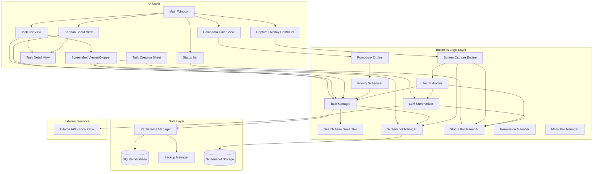
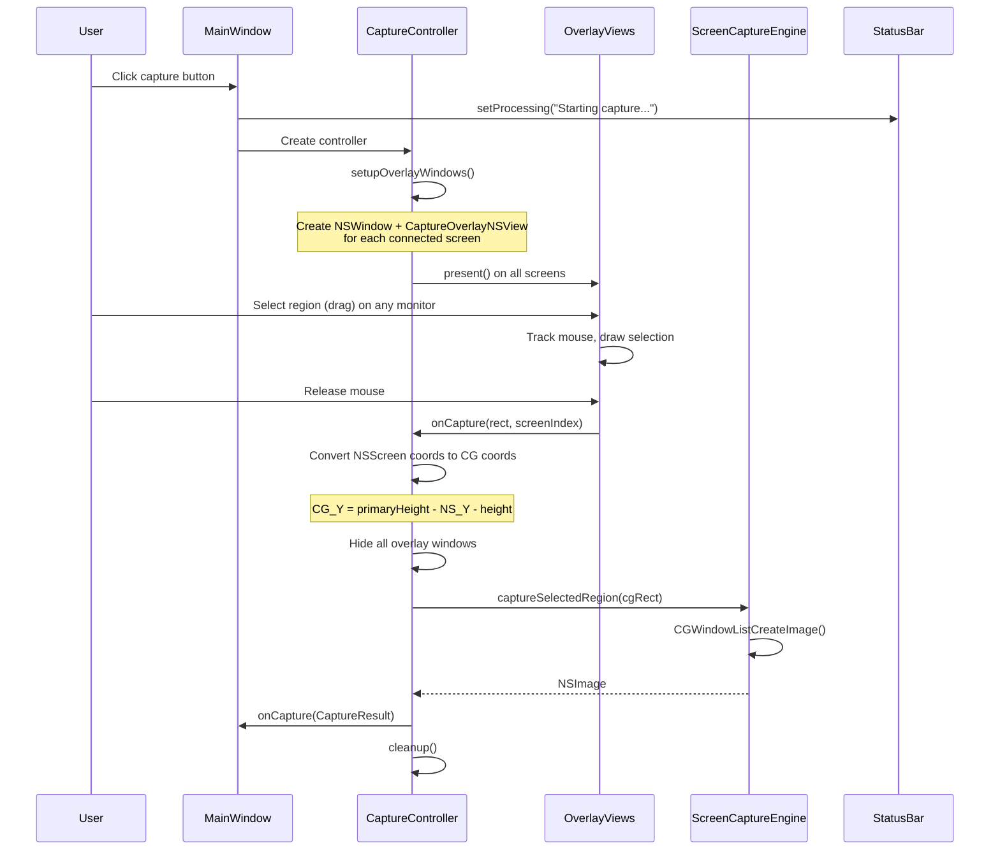
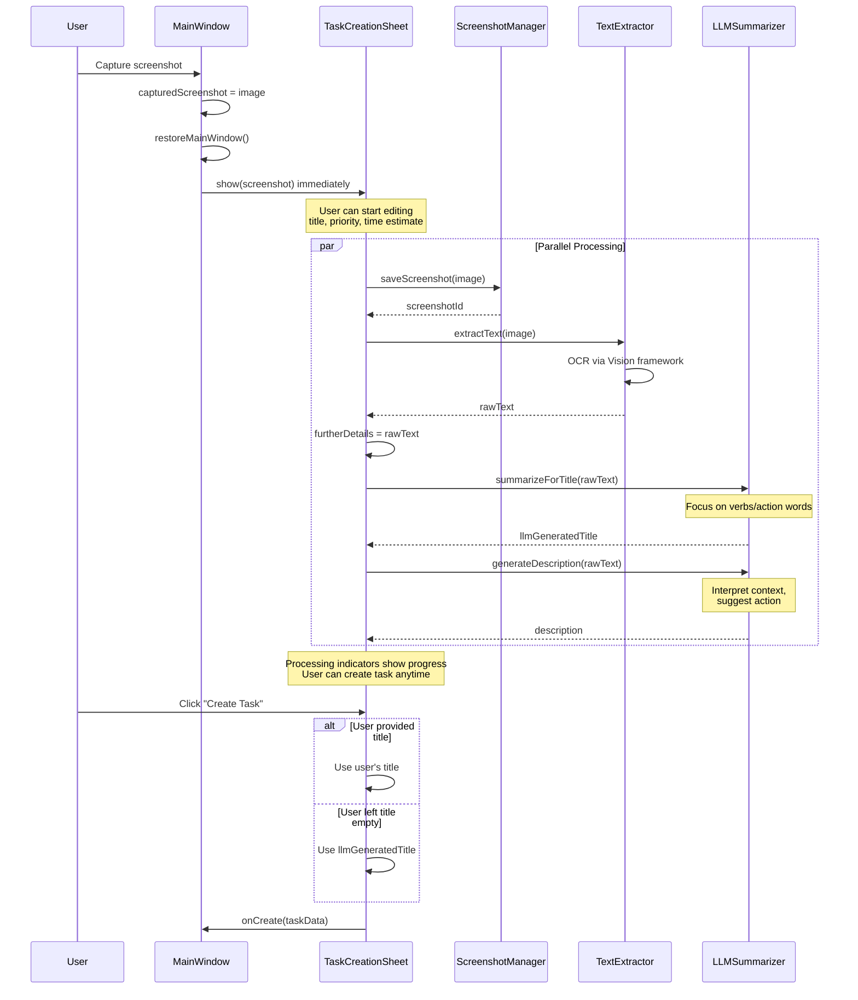
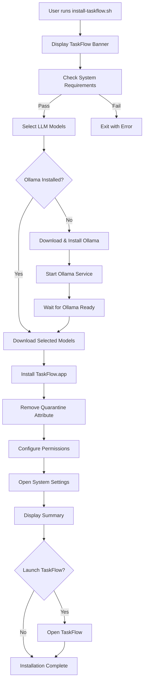

# Design Document: TaskFlow App

## Overview

TaskFlow is a native macOS application built using Swift and SwiftUI, providing a modern, performant productivity tool. The application uses a layered architecture with clear separation between UI, business logic, and data persistence. Core data is stored locally using SQLite with automatic backup mechanisms to ensure data integrity across reboots and unexpected shutdowns.

The application leverages macOS native APIs for screen capture (CGWindowListCreateImage for multi-monitor support), text extraction (Vision framework for OCR), and system integration. It integrates with local Ollama LLM models for intelligent task title generation, ensuring complete privacy with no internet connectivity required. The UI follows a cyberpunk aesthetic with a dark theme, neon purple accents, and subtle glow effects.

## Architecture



## Components and Interfaces

### Task Model

```swift
struct Task: Identifiable, Codable {
    let id: UUID
    var title: String
    var description: String
    var sourceContent: String           // OCR extracted text
    var furtherDetails: String          // Editable details section from OCR
    var screenshotId: UUID?             // Reference to stored screenshot
    var assignedTo: String?             // Person or company assigned to this task
    var timeEstimate: TimeEstimate
    var priority: Priority
    var status: TaskStatus
    var kanbanColumn: KanbanColumn?
    var createdAt: Date
    var updatedAt: Date
    var metadata: TaskMetadata
}

enum TimeEstimate: Int, Codable, CaseIterable {
    case ten = 10
    case twenty = 20
    case forty = 40
    case sixty = 60
    case overSixty = 90  // Represents 60+ minutes
}

enum Priority: Int, Codable, CaseIterable {
    case low = 1
    case medium = 2
    case mega = 3
}

enum TaskStatus: String, Codable {
    case pending
    case inProgress
    case completed
    case deferred
    case deleted
}

enum KanbanColumn: String, Codable, CaseIterable {
    case backlog
    case inProgress
    case blocked
    case done
    case deleted
}

struct TaskMetadata: Codable {
    var sender: String?
    var recipient: String?
    var subject: String?
    var sourceApp: String?
    var capturedAt: Date?
    var keywords: [String]
    var llmGeneratedTitle: Bool
}
```

### Assignee Manager Interface

```swift
/// Manages assignee names with persistence and autocomplete
class AssigneeManager: ObservableObject {
    static let shared: AssigneeManager
    
    @Published var savedAssignees: [String]
    
    func addAssignee(_ name: String)              // Add new assignee (if not exists)
    func suggestions(for query: String) -> [String]  // Get autocomplete suggestions
    func removeAssignee(_ name: String)           // Remove from saved list
}
```

### Search Filter Interface

```swift
/// Filters tasks based on search queries
extension MainWindowView {
    func filterTasks(_ tasks: [Task]) -> [Task] {
        // Searches across: title, description, furtherDetails, 
        // assignedTo, keywords, sender, subject
    }
}
```

### Menu Bar Manager Interface

```swift
/// Manages the menu bar status item for quick task creation
/// Per Requirement 15 (Menu Bar Integration)
class MenuBarManager: NSObject, ObservableObject {
    static let shared: MenuBarManager
    
    func setup(onCaptureRequested: @escaping () -> Void)  // Initialize menu bar item
    func teardown()                                        // Remove menu bar item
    func showLoadingOverlay()                              // Show loading overlay during capture
    func hideLoadingOverlay()                              // Hide loading overlay
}
```

### Window Hiding Interface

```swift
/// Window hiding during capture (in MainWindowView)
/// Per Requirement 14 (Window Hiding During Capture)
extension MainWindowView {
    func hideMainWindow()     // Hide window before capture overlay
    func restoreMainWindow()  // Restore window after capture completes/cancels
}

/// Helper to access NSWindow from SwiftUI
struct WindowAccessor: NSViewRepresentable {
    @Binding var window: NSWindow?
}

/// Wrapper for captured screenshot to use with sheet(item:) binding
/// This ensures the screenshot is available when the sheet appears
/// Per Requirement 19.10 (First-capture reliability)
public struct CapturedScreenshotItem: Identifiable {
    public let id: UUID
    public let image: NSImage
    
    public init(image: NSImage, id: UUID = UUID())
}
```

### Multi-Monitor Capture Overlay Controller

```swift
/// Multi-monitor capture overlay controller
/// Creates overlay windows on all connected screens using AppKit views
class CaptureOverlayWindowController: NSObject {
    private var overlayWindows: [NSWindow]
    private var overlayViews: [CaptureOverlayNSView]
    
    func present()                    // Show overlays on all screens
    func handleCapture(rect: CGRect, screenIndex: Int)  // Process capture from specific screen
    func performCapture(for globalRect: CGRect, on screen: NSScreen)  // Execute capture with coordinate conversion
    func cancelCapture()              // Close all overlays
    func cleanup()                    // Release resources
}

/// AppKit-based overlay view for screen capture selection
class CaptureOverlayNSView: NSView {
    var screenFrame: CGRect
    var screenIndex: Int
    var onCapture: ((CGRect, Int) -> Void)?
    var onCancel: (() -> Void)?
    
    // Mouse handling for region selection
    override func mouseDown(with event: NSEvent)
    override func mouseDragged(with event: NSEvent)
    override func mouseUp(with event: NSEvent)
    
    // Keyboard handling for escape
    override func keyDown(with event: NSEvent)
}
```

### Screen Capture Engine Interface

```swift
struct CaptureResult {
    let image: NSImage
    let region: CGRect
}

protocol ScreenCaptureEngineProtocol {
    func checkPermission() -> Bool
    func requestPermission() async -> Bool
    func captureScreen() async throws -> NSImage
    func captureSelectedRegion(rect: CGRect) async throws -> NSImage
}
```

### LLM Summarizer Interface

```swift
struct LLMSummaryResult {
    let title: String
    let wasGenerated: Bool  // true if LLM generated, false if fallback
}

protocol LLMSummarizerProtocol {
    var isAvailable: Bool { get async }
    func summarizeForTitle(text: String) async -> LLMSummaryResult
    func generateDescription(from text: String) async -> String  // Generate contextual summary
    func warmup() async  // Pre-load model at app startup
}

/// LLM Summarizer with performance optimizations
/// Per Requirements 2B.1, 2B.12, 19.3, 19.4
class LLMSummarizer: LLMSummarizerProtocol {
    // Default model - gemma3:1b is fast and capable
    static let defaultModel = "gemma3:1b"
    
    // Fallback models to try in order of preference
    static let fallbackModels = [
        "gemma3:1b",       // Primary: fast and capable
        "gemma3",          // Alternative gemma3 tag
        "gemma:2b",        // Older gemma if available
    ]
    
    // Performance options for fast title generation
    static let fastOptions: [String: Any] = [
        "num_predict": 50,      // Limit output tokens
        "temperature": 0.3,     // Focused output
        "top_p": 0.9,           // Nucleus sampling
    ]
    
    /// Generate action-oriented title focusing on verbs
    /// Prompt emphasizes action words like "Review", "Complete", "Send", "Follow up"
    func summarizeForTitle(text: String) async -> LLMSummaryResult
    
    /// Generate contextual description that interprets the content
    /// and suggests what action the user might need to take
    func generateDescription(from text: String) async -> String
}
```

### Task Creation Sheet Interface

```swift
/// Processing state for async OCR and LLM operations
enum ProcessingState {
    case idle
    case processing
    case complete
    case error(String)
}

/// Sheet for creating a new task with parallel processing
/// Per Requirement 19 (Immediate Task Creation with Parallel Processing)
struct TaskCreationSheet: View {
    // Screenshot shown immediately
    let screenshot: NSImage?
    let screenshotId: UUID?
    
    // Services for parallel processing
    let screenshotManager: ScreenshotManager?
    let textExtractor: TextExtractor?
    let llmSummarizer: LLMSummarizer?
    
    // Processing states (displayed as indicators in header)
    @State var ocrState: ProcessingState
    @State var llmTitleState: ProcessingState
    @State var llmDescriptionState: ProcessingState
    
    // User can edit while processing happens
    @State var title: String              // User-editable, LLM suggestion shown below
    @State var description: String        // Populated by LLM contextual summary
    @State var furtherDetails: String     // Populated by OCR
    
    // If user doesn't provide title, LLM title is used on create
    @State var llmGeneratedTitle: String
    @State var userHasEditedTitle: Bool
}
```

### Settings Manager Interface

```swift
/// Manages app settings persistence including LLM model selection
class SettingsManager: ObservableObject {
    static let shared: SettingsManager
    
    @Published var selectedModel: String?
    @Published var availableModels: [String]
    
    func updateAvailableModels(_ models: [String])
    func getActiveModel(defaultModel: String) -> String
}
```

### Ollama Client Interface

```swift
protocol OllamaClientProtocol {
    func checkConnection() async -> Bool
    func listModels() async -> [String]
    func generate(prompt: String, model: String, options: [String: Any]?) async throws -> String
    func warmupModel(_ model: String) async -> Bool
}
```

### Task Manager Interface

```swift
protocol TaskManagerProtocol {
    func createTask(from extraction: TextExtraction, screenshotId: UUID?, timeEstimate: TimeEstimate, priority: Priority, llmGeneratedTitle: Bool) -> Task
    func updateTask(_ task: Task) -> Bool
    func softDeleteTask(_ task: Task)           // Moves to Kanban "Deleted" column
    func permanentlyDeleteTask(id: UUID) -> Bool
    func getAllTasks() -> [Task]
    func getActiveTasks() -> [Task]
    func getKanbanTasks() -> [Task]
    func moveToKanban(_ task: Task, column: KanbanColumn)
    func moveFromKanban(_ task: Task)
    func moveKanbanColumn(_ task: Task, to: KanbanColumn)
    func markComplete(_ task: Task)
    func restoreFromDeleted(_ task: Task)
}
```

### Screenshot Manager Interface

```swift
struct StoredScreenshot {
    let id: UUID
    let image: NSImage
    let capturedAt: Date
    let originalSize: CGSize
}

protocol ScreenshotManagerProtocol {
    func saveScreenshot(_ image: NSImage) throws -> UUID
    func loadScreenshot(id: UUID) throws -> StoredScreenshot?
    func cropScreenshot(id: UUID, to rect: CGRect) throws -> UUID
    func deleteScreenshot(id: UUID) throws
    func getScreenshotPath(id: UUID) -> URL?
}
```

### Backup Manager Interface

```swift
/// Type of backup for retention policy management
enum BackupType: String, Codable {
    case manual      // User-initiated backups (keep max 5)
    case daily       // Automatic daily backups (keep 14 days)
    case preMigration // Created before schema migrations (keep all)
}

/// Information about a backup file
struct BackupInfo: Identifiable {
    let id: UUID
    let url: URL
    let createdAt: Date
    let fileSize: Int64
    let taskCount: Int?
    let screenshotCount: Int
    let backupType: BackupType
    let isZipArchive: Bool
    
    var formattedDate: String
    var formattedSize: String
    var typeLabel: String
}

/// Manages backup creation, restoration, and scheduling
/// Per Requirements 20.13-20.16 (Screenshot inclusion and retention policy)
class BackupManager: ObservableObject {
    static let shared: BackupManager
    
    @Published var isCreatingBackup: Bool
    @Published var isRestoring: Bool
    @Published var lastBackupDate: Date?
    @Published var availableBackups: [BackupInfo]
    
    var backupDirectory: URL
    
    // Backup creation
    func createBackup() throws -> URL           // Manual backup with screenshots (zip)
    func createPreMigrationBackup() throws -> URL  // Pre-migration backup
    func createDailyBackupIfNeeded()            // Daily backup if none today
    
    // Restoration
    func restoreFromBackup() throws -> [Task]   // Restore from most recent
    func restoreFromBackup(_ backup: BackupInfo) throws -> [Task]
    
    // Export/Import
    func exportBackup(_ backup: BackupInfo, to destination: URL) throws
    func importBackup(from source: URL) throws -> BackupInfo
    func deleteBackup(_ backup: BackupInfo) throws
    
    // Validation
    func validateAndRecover() throws -> Bool
    
    // Scheduling
    func startDailyBackupSchedule()             // Check hourly for daily backup
    func stopDailyBackupSchedule()
    
    // Cleanup (automatic)
    // - Manual backups: keep max 5
    // - Daily backups: keep one per day for 14 days
    // - Pre-migration backups: keep all
}
```

### Text Extractor Interface

```swift
struct TextExtraction {
    let rawText: String
    let sender: String?
    let recipient: String?
    let subject: String?
    let bodyContent: String
    let detectedApp: String?
    let keywords: [String]
}

protocol TextExtractorProtocol {
    func extractText(from image: CGImage) async throws -> TextExtraction
    func extractText(from image: NSImage) async throws -> TextExtraction
}
```

### Status Bar Manager Interface

```swift
enum StatusBarState {
    case idle
    case processing(message: String)
    case success(message: String)
    case warning(message: String)
    case error(message: String)
}

protocol StatusBarManagerProtocol: ObservableObject {
    var currentState: StatusBarState { get }
    var statusMessage: String { get }
    var statusColor: Color { get }
    
    func setProcessing(_ message: String)
    func setSuccess(_ message: String)
    func setWarning(_ message: String)
    func setError(_ message: String)
    func clearStatus()
    func clearAfterDelay(_ seconds: TimeInterval)
}
```

### Pomodoro Engine Interface

```swift
protocol PomodoroEngineProtocol {
    var remainingTime: TimeInterval { get }
    var isRunning: Bool { get }
    var currentTask: Task? { get }
    var upcomingTasks: [Task] { get }
    
    func startSession(duration: TimeInterval)
    func pauseSession()
    func resumeSession()
    func stopSession()
    func completeCurrentTask()
    func skipCurrentTask()
}

/// Pomodoro Engine pulls tasks from Kanban columns (Backlog, In Progress, Blocked)
/// Tasks are sorted by priority (Mega > Medium > Low)
class PomodoroEngine: PomodoroEngineProtocol {
    func refreshTaskQueue() {
        // Get tasks from Kanban backlog, in progress, and blocked columns
        var kanbanTasks: [Task] = []
        kanbanTasks.append(contentsOf: taskManager.getTasks(inColumn: .backlog))
        kanbanTasks.append(contentsOf: taskManager.getTasks(inColumn: .inProgress))
        kanbanTasks.append(contentsOf: taskManager.getTasks(inColumn: .blocked))
        
        // Sort by priority using the scheduler
        upcomingTasks = scheduler.prioritizeTasks(kanbanTasks, remainingTime: remainingTime)
    }
}
```

### Priority Scheduler Interface

```swift
protocol PrioritySchedulerProtocol {
    func prioritizeTasks(_ tasks: [Task], remainingTime: TimeInterval) -> [Task]
    func getNextTask(from tasks: [Task], remainingTime: TimeInterval) -> Task?
}
```

## Data Models

### SQLite Schema

```sql
CREATE TABLE tasks (
    id TEXT PRIMARY KEY,
    title TEXT NOT NULL,
    description TEXT,
    source_content TEXT,
    further_details TEXT,
    screenshot_id TEXT,
    time_estimate INTEGER NOT NULL,
    priority INTEGER NOT NULL,
    status TEXT NOT NULL,
    kanban_column TEXT,
    created_at TEXT NOT NULL,
    updated_at TEXT NOT NULL
);

CREATE TABLE task_metadata (
    task_id TEXT PRIMARY KEY,
    sender TEXT,
    recipient TEXT,
    subject TEXT,
    source_app TEXT,
    captured_at TEXT,
    keywords TEXT,
    llm_generated_title INTEGER DEFAULT 0,
    FOREIGN KEY (task_id) REFERENCES tasks(id) ON DELETE CASCADE
);

CREATE TABLE screenshots (
    id TEXT PRIMARY KEY,
    file_path TEXT NOT NULL,
    captured_at TEXT NOT NULL,
    original_width INTEGER NOT NULL,
    original_height INTEGER NOT NULL
);

CREATE TABLE app_settings (
    key TEXT PRIMARY KEY,
    value TEXT NOT NULL
);

CREATE TABLE backups (
    id INTEGER PRIMARY KEY AUTOINCREMENT,
    created_at TEXT NOT NULL,
    data BLOB NOT NULL
);
```

### Screenshot Storage

Screenshots are stored as PNG files in the Application Support directory:
- Path: `~/Library/Application Support/TaskFlow/Screenshots/{uuid}.png`
- Original images are preserved; cropped versions create new files
- Screenshot metadata stored in SQLite
- Orphaned screenshots cleaned up periodically

### App Icon Generation

The application uses a custom cyberpunk-themed icon with the following specifications:

**Icon Requirements:**
- Source image: 1024x1024 PNG with transparent background
- Branding: "TaskFlow" text with purple/pink neon glow on dark rounded rectangle
- Background: Transparent (white pixels converted to alpha=0)

**Icon Generation Process:**
```python
# Convert white background to transparent using PIL
from PIL import Image
img = Image.open('AppIcon_original.png').convert('RGBA')
pixels = img.load()
for y in range(img.height):
    for x in range(img.width):
        r, g, b, a = pixels[x, y]
        if r > 240 and g > 240 and b > 240:  # White/near-white
            pixels[x, y] = (255, 255, 255, 0)  # Make transparent
img.save('AppIcon_transparent.png')
```

**Required Icon Sizes (AppIcon.iconset/):**
| Filename | Size | Purpose |
|----------|------|---------|
| icon_16x16.png | 16x16 | Small icon |
| icon_16x16@2x.png | 32x32 | Small icon (Retina) |
| icon_32x32.png | 32x32 | Medium icon |
| icon_32x32@2x.png | 64x64 | Medium icon (Retina) |
| icon_128x128.png | 128x128 | Large icon |
| icon_128x128@2x.png | 256x256 | Large icon (Retina) |
| icon_256x256.png | 256x256 | Extra large icon |
| icon_256x256@2x.png | 512x512 | Extra large icon (Retina) |
| icon_512x512.png | 512x512 | Huge icon |
| icon_512x512@2x.png | 1024x1024 | Huge icon (Retina) |

**Icon Conversion:**
```bash
# Generate all sizes from transparent source
sips -z 16 16 AppIcon_transparent.png --out AppIcon.iconset/icon_16x16.png
sips -z 32 32 AppIcon_transparent.png --out AppIcon.iconset/icon_16x16@2x.png
# ... (all sizes)

# Convert iconset to .icns
iconutil -c icns AppIcon.iconset -o AppIcon.icns
```

**Info.plist Configuration:**
```xml
<key>CFBundleIconFile</key>
<string>AppIcon</string>
```

**Build Script Integration:**
The build-app.sh script copies AppIcon.icns to the app bundle's Resources directory.

## Multi-Monitor Capture Flow



## Screen Capture Processing Flow (Immediate Display with Parallel Processing)



## Coordinate System Conversion

The multi-monitor capture system must handle coordinate conversion between two different coordinate systems:

**NSScreen Coordinates (Cocoa):**
- Origin (0,0) at BOTTOM-LEFT of primary display
- Y increases upward
- Screens above primary have positive Y values
- Screens below primary have negative Y values

**CGWindowList Coordinates (Core Graphics):**
- Origin (0,0) at TOP-LEFT of primary display
- Y increases downward
- Screens above primary have negative Y values
- Screens below primary have positive Y values

**Conversion Formula:**
```swift
let primaryHeight = primaryScreen.frame.height
let cgRect = CGRect(
    x: globalRect.origin.x,
    y: primaryHeight - globalRect.origin.y - globalRect.height,
    width: globalRect.width,
    height: globalRect.height
)
```

## Correctness Properties

*A property is a characteristic or behavior that should hold true across all valid executions of a system—essentially, a formal statement about what the system should do.*

### Property 1: Data Persistence Round Trip

*For any* valid Task object, saving it to the persistence layer and then loading all tasks SHALL return a collection containing an equivalent Task object with all fields preserved.

**Validates: Requirements 1.1, 1.2**

### Property 2: Backup Recovery Equivalence

*For any* set of tasks saved before a backup is created, restoring from that backup SHALL return an equivalent set of tasks with all data intact.

**Validates: Requirements 1.3, 1.5**

### Property 3: Task Creation Preserves Content

*For any* TextExtraction and valid time/priority combination, creating a task SHALL produce a Task where the sourceContent contains the extraction's rawText and metadata fields match the extraction.

**Validates: Requirements 2.4, 3.3**

### Property 4: Task Field Bounds

*For any* task, the timeEstimate SHALL be one of (10, 20, 40, 60, 90) minutes AND the priority SHALL be one of (low=1, medium=2, mega=3).

**Validates: Requirements 3.1, 3.2**

### Property 5: Priority Scheduler Ordering

*For any* list of tasks, the Priority Scheduler SHALL return tasks ordered by priority descending (Mega > Medium > Low), then by time estimate ascending within the same priority level.

**Validates: Requirements 4.2**

### Property 6: Scheduler Time Filtering

*For any* list of tasks and remaining session time, the Priority Scheduler SHALL only return tasks whose time estimate is less than or equal to the remaining time.

**Validates: Requirements 4.3**

### Property 7: Task Completion Advances to Next

*For any* active Pomodoro session with multiple tasks, marking the current task complete SHALL advance currentTask to the next task in priority order.

**Validates: Requirements 4.4**

### Property 8: Kanban Membership Invariant

*For any* task, if its kanbanColumn is set (not nil), it SHALL NOT appear in getActiveTasks(); if kanbanColumn is nil, it SHALL appear in getActiveTasks() (assuming status is not completed or deleted).

**Validates: Requirements 5.3, 5.4**

### Property 9: Search Term Generation

*For any* task with non-empty sourceContent or at least one non-nil metadata field (sender, recipient, subject), the Search Term Generator SHALL produce at least one search term containing relevant content from those fields.

**Validates: Requirements 6.1, 6.2**

### Property 10: OCR Text Extraction

*For any* image containing readable text, the Text Extractor SHALL return a TextExtraction with non-empty rawText.

**Validates: Requirements 2.4**

### Property 11: Screenshot Storage Round Trip

*For any* valid NSImage, saving it via ScreenshotManager and loading it back SHALL return an equivalent image with the same dimensions.

**Validates: Requirements 2A.1, 2A.2**

### Property 12: Task Completion Moves to Done

*For any* task in the active task list, calling markComplete SHALL result in the task having kanbanColumn = .done and status = .completed.

**Validates: Requirements 5.6**

### Property 13: Task Deletion Moves to Deleted Column

*For any* task in the active task list, calling softDeleteTask SHALL result in the task having kanbanColumn = .deleted and status = .deleted (not permanently removed).

**Validates: Requirements 5.7**

### Property 14: Screenshot Crop Creates New Image

*For any* stored screenshot and valid crop rectangle, cropping SHALL create a new screenshot with dimensions matching the crop rectangle, preserving the original screenshot.

**Validates: Requirements 2A.3, 2A.4**

### Property 15: Kanban Drag-and-Drop Updates Column

*For any* task on the Kanban board and any valid target column, dragging and dropping the task SHALL result in the task's kanbanColumn being updated to the target column and the change being persisted.

**Validates: Requirements 5.5, 5.9, 5.10**

### Property 16: Multi-Monitor Capture Coordinate Conversion

*For any* selection rectangle on any connected monitor, the coordinate conversion from NSScreen to CGWindowList coordinates SHALL produce a capture that matches the visually selected region.

**Validates: Requirements 2.1, 2.2, 2.3, 2.9**

### Property 17: LLM Fallback Behavior

*For any* OCR text input, when the LLM is unavailable, the LLM Summarizer SHALL return a fallback title derived from the first line of text with wasGenerated = false.

**Validates: Requirements 2B.3**

### Property 18: Pomodoro Task Source

*For any* Pomodoro session, the tasks displayed SHALL be sourced from Kanban Backlog, In Progress, and Blocked columns only, sorted by priority (Mega > Medium > Low).

**Validates: Requirements 4.2**

### Property 19: Pomodoro Task Edit

*For any* task displayed in the Pomodoro view, double-clicking the task card SHALL open the task detail view for editing.

**Validates: Requirements 4.8**

### Property 20: Assignee Autocomplete Persistence

*For any* assignee name saved with a task, the Assignee Manager SHALL include that name in future autocomplete suggestions.

**Validates: Requirements 10.2, 10.3**

### Property 21: Screenshot Replacement Updates Task

*For any* task with an existing screenshot, replacing the screenshot SHALL update the task's screenshotId to reference the new image while preserving all other task data.

**Validates: Requirements 11.2, 11.3**

### Property 22: Search Filter Matches All Fields

*For any* search query and task collection, the Search Filter SHALL return only tasks where at least one of (title, description, furtherDetails, assignedTo, keywords, sender, subject) contains the query string (case-insensitive).

**Validates: Requirements 12.2, 12.3**

### Property 23: Search Clear Restores All Tasks

*For any* filtered task view, clearing the search SHALL restore the view to show all tasks that would be visible without any filter applied.

**Validates: Requirements 12.5, 12.6**

### Property 24: Assignee Display Consistency

*For any* task with a non-empty assignedTo field, the task SHALL display the assignee name with a person icon in both the Task List view and Kanban Board view.

**Validates: Requirements 10.4**

### Property 25: App Icon Transparency

*For any* built application bundle, the AppIcon.icns file SHALL have transparent corners (alpha=0) such that no white border appears when displayed in the macOS Dock or Launchpad.

**Validates: Requirements 13.5**

### Property 26: Window Hidden During Capture

*For any* capture operation initiated from the main window or menu bar, the main window SHALL be hidden before the capture overlay is displayed and SHALL be restored after capture completes or is cancelled.

**Validates: Requirements 14.1, 14.2, 14.3, 14.4**

### Property 27: Menu Bar Capture Triggers Flow

*For any* "New Task from Capture" selection from the menu bar, the capture flow SHALL be initiated identically to clicking the capture button in the main window.

**Validates: Requirements 15.4, 15.7**

### Property 28: Menu Bar Persistence

*For any* running instance of TaskFlow, the menu bar icon SHALL remain visible and functional regardless of the main window's visibility state.

**Validates: Requirements 15.1, 15.8**

### Property 29: Immediate Task Creation Display

*For any* screenshot capture, the task creation sheet SHALL be displayed immediately with the screenshot visible, before OCR or LLM processing completes.

**Validates: Requirements 19.1**

### Property 30: Parallel Processing Independence

*For any* task creation session, the user SHALL be able to edit title, priority, and time estimate fields while OCR and LLM processing run in parallel without blocking user interaction.

**Validates: Requirements 19.2, 19.9**

### Property 31: LLM Title Fallback on Empty

*For any* task creation where the user leaves the title field empty, the task SHALL be created with the LLM-generated title (or fallback title if LLM unavailable).

**Validates: Requirements 19.7, 2B.13**

### Property 32: Action-Oriented Title Generation

*For any* LLM-generated title, the title SHALL begin with or prominently feature an action verb when the source text contains actionable content.

**Validates: Requirements 2B.12**

### Property 33: Contextual Description Generation

*For any* OCR text processed by the LLM, the generated description SHALL interpret the context and suggest what action the user might need to take.

**Validates: Requirements 19.3, 19.4**

### Property 34: First-Capture Screenshot Availability

*For any* screen capture operation (including the first capture after app launch), the task creation sheet SHALL receive the screenshot image before its onAppear lifecycle method fires, ensuring OCR/LLM processing can begin immediately.

**Validates: Requirements 19.1, 19.10**

### Property 35: Schema Version Tracking

*For any* database initialization, the schema_info table SHALL contain the current schema version, and all applied migrations SHALL be recorded in the migration_history table.

**Validates: Requirements 20.1, 20.3**

### Property 36: Pre-Migration Backup

*For any* schema upgrade from version N to version M (where N < M), a backup SHALL be created before any migrations are applied, and the backup path SHALL be available in the MigrationResult.

**Validates: Requirements 20.2**

### Property 37: Backup Restoration Completeness

*For any* backup restoration operation, all tasks from the backup SHALL be restored to the database, and the TaskManager SHALL reflect the restored data after calling reloadTasks().

**Validates: Requirements 20.8, 20.10**

### Property 38: Backup Export Portability

*For any* exported backup file, importing that file on another machine with TaskFlow installed SHALL successfully restore all tasks contained in the backup.

**Validates: Requirements 20.12**

### Property 39: Backup Screenshot Inclusion

*For any* backup created via createBackup() or createPreMigrationBackup(), the resulting zip archive SHALL contain all screenshots referenced by the backed-up tasks.

**Validates: Requirements 20.13**

### Property 40: Manual Backup Retention Limit

*For any* collection of manual backups, the BackupManager SHALL retain at most 5 manual backups, automatically deleting the oldest when the limit is exceeded.

**Validates: Requirements 20.14**

### Property 41: Daily Backup Retention Policy

*For any* collection of daily backups, the BackupManager SHALL retain one backup per day for the last 14 days, deleting older daily backups and duplicate same-day backups.

**Validates: Requirements 20.15, 20.16**

### Property 42: Task Editor Field Ordering

*For any* task creation or edit view, the "Further Details (from OCR)" section SHALL appear after the Priority selection and before the Status section (in edit view) or at the bottom of the form (in creation view).

**Validates: Requirements 21.1, 21.2, 21.3**

### Property 43: Screenshot ID Consistency

*For any* screen capture operation, the screenshot SHALL be saved to disk BEFORE the task creation sheet is displayed, and the saved screenshot's UUID SHALL be passed to the task creation sheet to ensure the task references the correct persisted image.

**Validates: Requirements 2A.1, 19.1**

## Error Handling

### Screen Capture Errors

| Error | Handling |
|-------|----------|
| Permission denied | Display permission request dialog with instructions |
| Capture failed | Show error in status bar, allow retry |
| No content detected | Notify user, allow manual entry |
| Region selection cancelled | Close overlays, return to normal state |

### Multi-Monitor Errors

| Error | Handling |
|-------|----------|
| Screen disconnected during capture | Cancel capture, show error |
| Coordinate conversion failure | Log error, attempt capture anyway |
| Window creation failed | Fall back to single-monitor capture |

### LLM Summarizer Errors

| Error | Handling |
|-------|----------|
| Ollama not running | Fall back to first line of text, show warning in status bar |
| Model not available | Try next model in preference list, then fall back |
| Timeout | Fall back to first line of text, continue with task creation |
| Invalid response | Fall back to first line of text |

### Persistence Errors

| Error | Handling |
|-------|----------|
| Database write failed | Retry 3 times, then queue for later |
| Database corrupted | Restore from most recent backup |
| Backup failed | Log error, continue operation, retry on next interval |

## Testing Strategy

### Unit Tests

- Task creation with various input combinations
- Priority scheduler with edge cases
- Search term extraction from different content types
- Database operations (CRUD)
- Backup creation and restoration
- Screenshot storage and retrieval
- LLM summarizer with mock responses
- Coordinate conversion for various monitor configurations

### Property-Based Tests

Using SwiftCheck library:

1. **Property 1-14**: Core functionality properties (implemented)
2. **Property 15**: Kanban drag-and-drop
3. **Property 16**: Multi-monitor coordinate conversion
4. **Property 17**: LLM fallback behavior

Each property test runs minimum 100 iterations.

### Integration Tests

- End-to-end task creation from multi-monitor screen capture
- Screenshot capture, crop, and re-OCR flow
- LLM title generation with Ollama integration
- Pomodoro session with task progression
- Kanban board interactions
- Data persistence across app restarts

### UI Tests

- Capture button functionality with multi-monitor overlay
- Screenshot viewer and cropping tools
- Quick-select time/priority controls
- Drag-and-drop Kanban operations
- Status bar displays correct messages during capture flow
- Escape key cancels capture on all monitors


## Distribution and Installation

### Installer Package

TaskFlow is distributed as a DMG containing:
- `TaskFlow.app` - The main application bundle
- `install-taskflow.sh` - Interactive installer script
- `README.txt` - Installation instructions

### Installer Script Features

The installer script (`install-taskflow.sh`) provides:

1. **System Requirements Check**
   - Verifies macOS 13+ (Ventura or later)
   - Detects processor architecture (Apple Silicon or Intel)
   - Checks available disk space (recommends 20GB+)
   - Detects existing Ollama installation

2. **LLM Model Selection**
   - Automatically installs gemma3:1b model
   - Model: `gemma3:1b` (~1.5GB) - Fast and capable, optimized for quick title generation

3. **Ollama Installation**
   - Downloads and installs Ollama if not present
   - Starts Ollama service automatically
   - Waits for service to be ready before proceeding

4. **Model Download**
   - Downloads selected models with progress indication
   - Skips already-downloaded models
   - Handles download failures gracefully

5. **TaskFlow Installation**
   - Copies TaskFlow.app to /Applications
   - Removes quarantine attribute for unsigned apps
   - Replaces existing installation if present

6. **Permission Configuration**
   - Opens System Settings to Screen Recording permissions
   - Guides user through permission grant process
   - Explains required permissions

7. **Post-Installation**
   - Displays installation summary
   - Quick start guide
   - Option to launch TaskFlow immediately

### DMG Creation

The `create-dmg.sh` script creates a distributable DMG:

```bash
cd TaskFlowMac/TaskFlow/Installer
./create-dmg.sh
```

This will:
1. Build TaskFlow.app if not present
2. Create a DMG containing the app and installer
3. Output to `TaskFlowMac/TaskFlow/dist/TaskFlow-Installer-1.0.0.dmg`

### Offline Operation

After installation, TaskFlow operates 100% offline:
- All LLM inference runs locally via Ollama
- No internet connection required for any feature
- Task data stored locally in SQLite
- Screenshots stored in Application Support directory

### Installation Requirements

| Requirement | Minimum | Recommended |
|-------------|---------|-------------|
| macOS Version | 13.0 (Ventura) | 14.0+ (Sonoma) |
| Disk Space | 5GB | 10GB+ |
| RAM | 8GB | 16GB+ |
| Processor | Intel or Apple Silicon | Apple Silicon |

### Installer Flow Diagram


